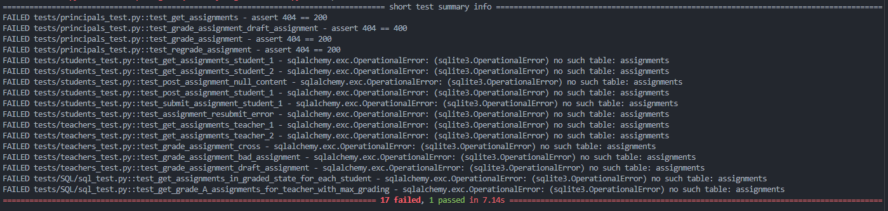
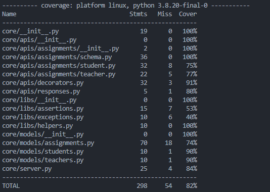

# Fyle Backend Challenge

## Who is this for?

This challenge is meant for candidates who wish to intern at Fyle and work with our engineering team. You should be able to commit to at least 6 months of dedicated time for internship.

## Why work at Fyle?

Fyle is a fast-growing Expense Management SaaS product. We are ~40 strong engineering team at the moment.

We are an extremely transparent organization. Check out our [careers page](https://careers.fylehq.com) that will give you a glimpse of what it is like to work at Fyle. Also, check out our Glassdoor reviews [here](https://www.glassdoor.co.in/Reviews/Fyle-Reviews-E1723235.htm). You can read stories from our teammates [here](https://stories.fylehq.com).

## Challenge outline

**You are allowed to use any online/AI tool such as ChatGPT, Gemini, etc. to complete the challenge. However, we expect you to fully understand the code and logic involved.**

This challenge involves writing a backend service for a classroom. The challenge is described in detail [here](./Application.md)

## What happens next?

You will hear back within 48 hours from us via email.

## Installation

1. Fork this repository to your github account
2. Clone the forked repository and proceed with steps mentioned below

### Install requirements

```
virtualenv env --python=python3.8
source env/bin/activate
pip install -r requirements.txt
```

### Reset DB

```
export FLASK_APP=core/server.py
rm core/store.sqlite3
flask db upgrade -d core/migrations/
```

### Start Server

```
bash run.sh
```

### Run Tests

```
pytest -vvv -s tests/

# for test coverage report
# pytest --cov
# open htmlcov/index.html
```

## Docker

### Building Image

```
docker-compose build
```

### Running Image

```
docker-compose up
```

### Run Tests

```
docker exec -it fyle_backend_container ./run_tests.sh

# For basic coverage report
docker exec -it fyle_backend_container ./run_tests.sh --coverage

# For detailed coverage report in HTML format...
docker exec -it fyle_backend_container ./run_tests.sh --cov-report
```

## Python Tests

### Initial Test Report



### Initial Coverage Report


