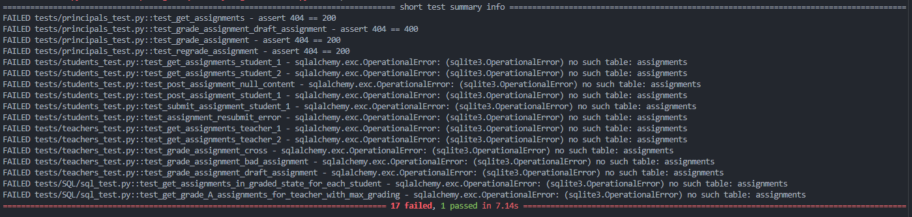
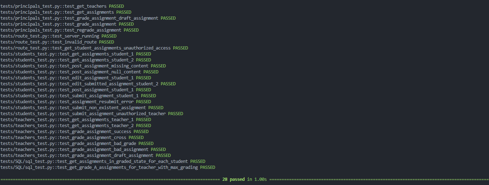
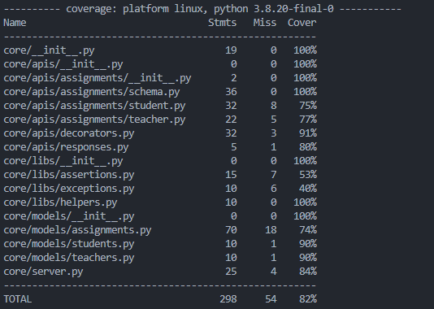
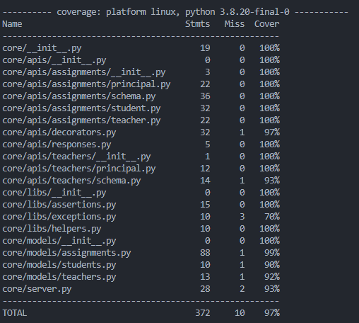

# Testing and Coverage Reports

This section outlines the procedures and results for testing and coverage analysis of the project.

## Test Commands

### Local Environment

To run tests in a local environment, use the following commands:

```
pytest -vvv -s tests/

# for test coverage report
# pytest --cov
# open htmlcov/index.html
```

### Docker

To execute tests within a Docker container, use these commands:

```
docker exec -it fyle_backend_container ./run_tests.sh

# For basic coverage report
docker exec -it fyle_backend_container ./run_tests.sh --coverage

# For detailed coverage report in HTML format...
docker exec -it fyle_backend_container ./run_tests.sh --cov-report
```

## Initial Test Report



## Final Coverage Report



## Initial Coverage Report



## Final Coverage Report


